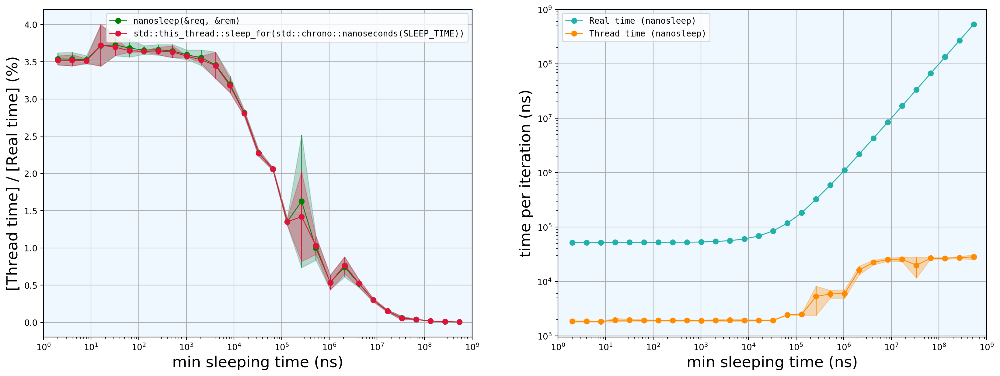
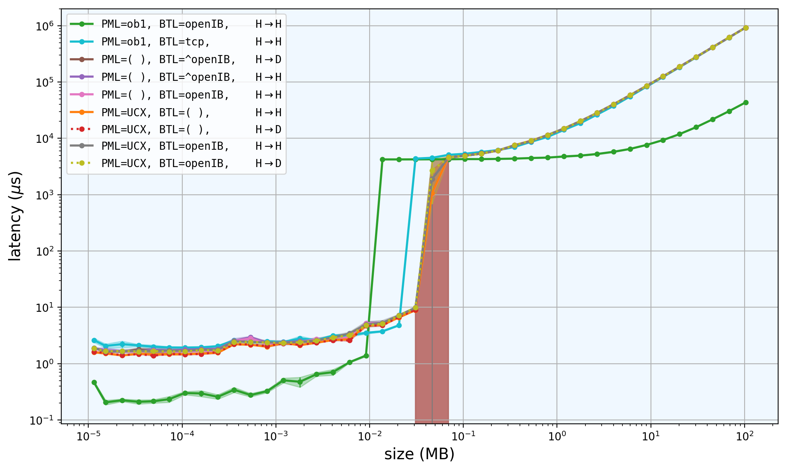
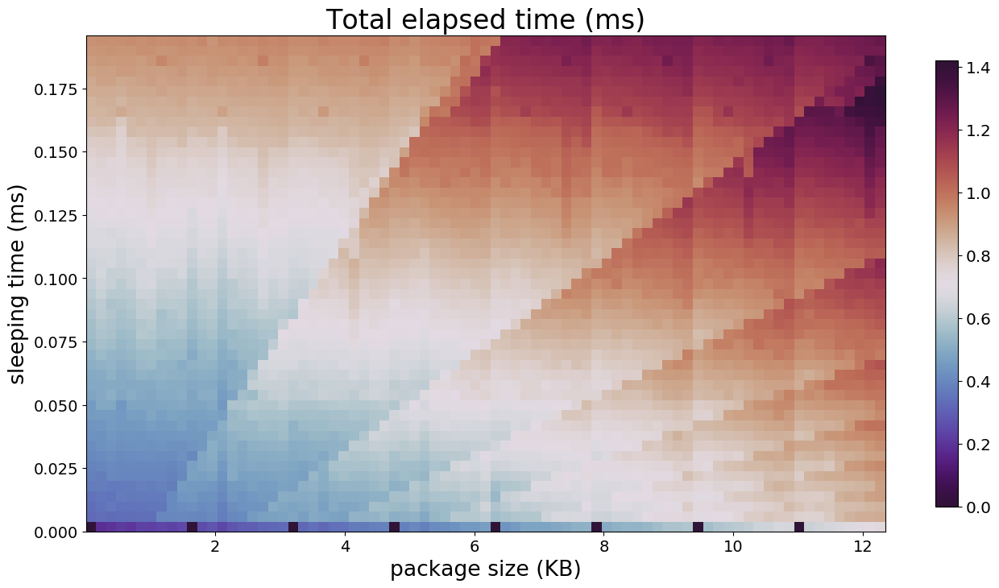

# Brief description of the scripts inside these folders

All the scripts within the same folder are compiled together with the same command. Here we describe with images (when possible) what can each of them be used for. For information about how are they compiled / run, as well as how they internally work, refer to the header of each file.

## CPUInsideTheLoop

This script measures the CPU time and the real time consumed inside an `Iprobe + sleep(...)` loop, as a function of the time we wait between `Iprobe` calls. The following graphs have been produced with the data coming from these scripts:

## MPIBenchmarks

It measures the time taken to send some package with MPI as a function of the package size, in many different situations. This plot has been produced with the output of the script:

## actualKernelTest

It uses RDMA to remotely run an actual kernel. Prints a readable output showing the time consumed at different stages of the processing.

A sample output of this script is the following:

    #0 is felk40
    #1 is patatrack01.cern.ch

    #1: hi! Leave the GPU stuff for me
    #1: allocating memory on the GPU took me 0.0286097 s
    #1: For the CPU buffer, I spent 0.000305602 s, but I will not use it!
    #0: hello! I'll do the CPU part of the job
    #0: allocating memory on the GPU took me 0.0788108 s, but I will not use it at all
    #0: For the CPU, I spent 0.00067617 s
    #0: Now I'm waiting for your results!
    #1: Fine, I'm about to launch the kernel
    #1: Launched!
    #1: Hey! I'm sending you the results!
    #1: Sent! running + sending took me only 0.0378262 seconds!
    #0: Received! I've got them!
    #0: I've been waiting (doing anything) for 0.0385369 seconds. Now I will compute the final result.

    ---------------------------------
    #0: pi = 3.141540818

## fullTest

This is the most complete (and complex) set of scripts. It does the same as the CMSSW plugin performing RDMA, but outside CMSSW.

It outputs a well formated table showing in the firs row different sleep times inside the loop, and in the first column different sizes of the package. The entries of the matrix are the time taken by the full process in each particular situation.

There are many ways to show the output of this file. One of them is this 2D plot:

## minimalTest

This is a minimal example, that just sends data H → D, D → H and H → H. You may use it to show that RDMA is working properly.

Sample output:

    rank 0: Calling MPI
    rank 0: done
    rank 1: Calling MPI
    rank 1: done

